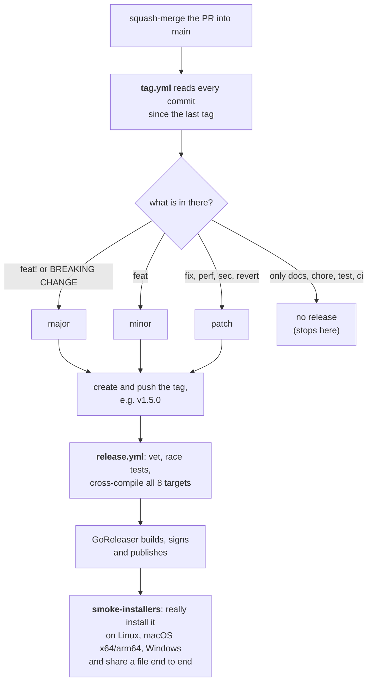

# Contributing to vrok

This is the whole process: how to branch, what to name a commit, what happens
when a pull request merges, and how a version number gets decided.

Nothing here is ceremony for its own sake. The commit message you write
determines the version that ships, so the conventions are load-bearing.

- [The short version](#the-short-version)
- [Branches](#branches)
- [Commit messages](#commit-messages)
- [Pull requests](#pull-requests)
- [Versioning](#versioning)
- [What happens when you merge](#what-happens-when-you-merge)
- [Releases](#releases)
- [Local development](#local-development)
- [Reporting bugs](#reporting-bugs)
- [Reporting a vulnerability](#reporting-a-vulnerability)

## The short version

```sh
git switch main && git pull
git switch -c fix/listing-escapes-root     # branch named after the work
# ... change things, add a test ...
make check                                 # fmt, vet, test — the same gate CI uses
git commit -m "fix(server): confine listings to the share root"
git push -u origin fix/listing-escapes-root
gh pr create --fill                        # title must be a conventional commit
```

A maintainer reviews it, you squash-merge into `main`, and the release
happens on its own. You never create a tag and never edit a version number.

### Contributing from a fork

Without write access to this repository, which is everyone outside the
maintainers, work in your own fork instead:

```sh
gh repo fork AliJabbar034/vrok --clone      # fork on GitHub and clone it
cd vrok
git switch -c fix/listing-escapes-root
# ... change things, add a test ...
make check
git commit -m "fix(server): confine listings to the share root"
git push -u origin fix/listing-escapes-root # pushes to your fork
gh pr create --fill --repo AliJabbar034/vrok
```

To bring your fork up to date before starting new work:

```sh
gh repo sync --branch main                  # updates your fork on GitHub
git switch main && git pull
```

What to expect after you open the pull request:

1. **CI waits for a maintainer** the first time you contribute. GitHub holds
   workflows from new contributors until someone approves the run, so nobody
   can use this repository's CI to run arbitrary code. After that it runs on
   every push.
2. **Secrets are never available to your pull request.** Tests that need
   them do not exist; if something only fails in your fork, say so in the PR.
3. **A maintainer reviews.** Expect questions and requested changes; push new
   commits to the same branch to answer them. Do not force-push over a review
   in progress, so the reviewer can see what changed.
4. **The maintainer squash-merges.** Your PR title becomes the commit on
   `main`, and you are credited as its author.

Leave "Allow edits by maintainers" ticked on the pull request, so small fixes
such as a typo or a rebase can be made without a round trip.

## Branches

`main` is the only long-lived branch. It is always releasable, and it is
protected: nothing lands on it except through a reviewed pull request.

Everything else is a short-lived branch off `main`, named `type/description`
with the same type you will use in the commit:

| Branch                         | For                                  |
| ------------------------------ | ------------------------------------ |
| `feat/share-expiry-warning`    | a new capability                     |
| `fix/relay-drops-large-bodies` | a defect                             |
| `docs/clarify-tunnel-setup`    | documentation only                   |
| `refactor/split-file-server`   | internal change, no behaviour change |
| `chore/bump-goreleaser`        | tooling, dependencies, CI            |

Use lowercase and hyphens. Describe the change, not yourself: `fix/range-requests`,
not `ali-patch-2`.

There is no `develop` branch and no long-running release branches. Work goes
to `main` and ships from `main`. If something is not ready to be seen, keep it
behind a flag rather than on a branch that drifts for weeks.

Delete your branch after it merges.

## Commit messages

vrok uses [Conventional Commits](https://www.conventionalcommits.org/). The
format is:

```
type(optional scope): description

optional body explaining why, not what

optional footer
```

The type is the part that matters, because the release automation reads it:

| Type       | Meaning                              | Effect on the version         |
| ---------- | ------------------------------------ | ----------------------------- |
| `feat`     | a new user-visible capability        | **minor** — `1.4.2` → `1.5.0` |
| `fix`      | a bug fix                            | **patch** — `1.4.2` → `1.4.3` |
| `perf`     | a performance improvement            | patch                         |
| `sec`      | a security fix                       | patch                         |
| `revert`   | undoing an earlier change            | patch                         |
| `refactor` | internal change, no behaviour change | none                          |
| `docs`     | documentation only                   | none                          |
| `test`     | tests only                           | none                          |
| `build`    | build system, dependencies           | none                          |
| `ci`       | CI configuration                     | none                          |
| `chore`    | anything else                        | none                          |

Scopes are the package you touched: `fix(server):`, `feat(tunnel):`,
`docs(security):`.

### Breaking changes

Mark a breaking change with `!` after the type, or a `BREAKING CHANGE:` footer:

```
feat!: remove the --insecure flag

BREAKING CHANGE: --insecure is gone. Use --tunnel local instead.
```

Either form forces a **major** bump. Explain the migration in the body —
it ends up in the release notes, and it is the only thing a user upgrading
will read.

### Writing a good description

Use the imperative mood and describe the effect, not the diff:

```
good:  fix(server): return 404 for symlinks escaping the share root
bad:   fix: changed notFoundOrError

good:  feat(tunnel): fetch cloudflared when no client is installed
bad:   feat: updates
```

The body is for _why_. The diff already shows what changed; it cannot show
what you knew when you changed it.

## Pull requests

**The title must be a conventional commit.** Merges are squashed, so the PR
title becomes the commit subject on `main` — which is what decides the
version. CI rejects a title that does not parse, because the alternative is a
release that silently does not happen.

Before opening one:

```sh
make check      # gofmt, go vet, go test — the gate CI applies
make race       # the race detector, if you touched concurrency
```

A reviewable pull request:

- does one thing, and is small enough to actually read
- adds a test that fails without the change
- explains _why_ in the description, and what you considered instead
- updates the docs in `docs/` if it changes behaviour
- has no commented-out code and no unrelated formatting churn

Mark it a draft if you want early feedback. One approving review is required,
and all CI checks must pass. Squash-merge is the only merge method enabled.

## Versioning

vrok follows [Semantic Versioning](https://semver.org/): `MAJOR.MINOR.PATCH`.

| Part      | Increments when                   | Example                                          |
| --------- | --------------------------------- | ------------------------------------------------ |
| **MAJOR** | an incompatible change            | removing a flag, changing output a script parses |
| **MINOR** | a backwards-compatible capability | a new flag, a new provider                       |
| **PATCH** | a backwards-compatible fix        | a bug, a security fix, a performance win         |

The public surface this applies to is the CLI: command names, flag names and
behaviour, exit codes, the config file format, and the relay wire protocol.
Internal package layout is not part of it and can change in any release.

### Before 1.0

While the major version is `0`, a breaking change bumps the **minor**
(`0.3.1` → `0.4.0`), which is what semver's 0.x clause says. The automation
handles this; you still write `feat!:`.

### You never pick the number

There is no version in any source file to edit. The binary learns its version
at build time through `-ldflags`, and the number itself is computed from the
commits. A human choosing version numbers is how a breaking change ships as a
patch.

## What happens when you merge



Two details worth knowing:

**A merge does not always release.** A pull request that only changed docs or
tests adds nothing user-visible, so no tag is created. The change is on `main`
and ships with whatever lands next.

**One breaking change beats a hundred fixes.** The highest bump in the batch
wins. Five `fix:` commits and one `feat!:` produce a major release.

## Releases

Everything is automated. Nobody tags by hand.

A release produces:

- signed archives for Linux, macOS and Windows on amd64 and arm64
- `.deb`, `.rpm` and `.apk` packages
- a Homebrew cask, a Scoop manifest and a winget manifest
- a `vrok-relay` container image on `ghcr.io`
- release notes grouped into Features, Fixes and Security, built from the
  commit subjects — which is the other reason the prefixes matter

The release is only published after the installers have been tested by
actually running them on each platform. The installers are the path most
people take, so a release that breaks them is worse than one that never
shipped.

### If a release fails halfway

The tag already exists, so do not try to recreate it. Re-run the release from
the Actions tab with **Run workflow** on `Release`, giving it the existing
tag. If the tag itself was wrong, ship a new patch — never move or delete a
published tag, because package managers have already recorded its checksums.

## Git hooks and formatting

Install the hooks once. They are plain shell in `.githooks/`, enabled through
`core.hooksPath`, so there is no dependency to install and nothing to run
before they work:

```sh
make hooks
```

| Hook         | Does                                                                                                          |
| ------------ | ------------------------------------------------------------------------------------------------------------- |
| `pre-commit` | formats staged Go files with `gofmt` and staged docs/config with Prettier, re-stages them, then runs `go vet` |
| `commit-msg` | rejects a subject that is not a conventional commit, and warns past 72 characters                             |
| `pre-push`   | refuses a push to `main`, checks the branch name, then runs `gofmt`, `go vet` and the tests                   |

Each one prints what to do about a failure. To skip a hook once, use
`git commit --no-verify` or `git push --no-verify`. CI applies the same rules,
so skipping only moves the failure later.

### Formatting

`gofmt` owns the Go. Prettier owns Markdown, YAML, JSON and CSS.

```sh
make fmt         # format everything
make fmt-check   # fail if anything is unformatted
```

Prettier is optional for contributors: `npm install` puts a pinned copy in
`node_modules`, and the hooks use it if it is there. Without Node, Go
formatting still runs and committing still works — CI reports anything
missed. Running `npm install` also enables the hooks, the same way Husky
would.

Go templates in `web/viewer/templates/` are excluded. Prettier does not
understand `{{...}}` and rewrites tag boundaries around actions, turning
`...</a><span>` into `...</a\n><span>`.

## Local development

```sh
make build      # bin/vrok and bin/vrok-relay
make test       # the unit and integration suites
make race       # with the race detector
make cover      # a coverage profile
make check      # fmt + vet + test, the same gate CI applies
make cross      # compile every released platform
```

[docs/development.md](docs/development.md) covers the package layout and how
to add a tunnel provider, a preview type, an availability rule or a share
kind. [docs/architecture.md](docs/architecture.md) explains how the pieces fit
together.

### House style

- Interfaces are declared by the package that _consumes_ them, not the one
  that implements them.
- A new tunnel provider, preview renderer or share kind should be a new file,
  not a new case in an existing switch.
- Comments explain constraints and decisions. If a comment restates the code,
  delete it.
- Test names are sentences about behaviour: `TestUnservablePathsAreIndistinguishable`,
  not `TestResolve2`.
- Every error a user can cause should tell them how to fix it.

## Reporting bugs

Open an issue with the output of `vrok --version`, your OS, the exact command
you ran, and what happened instead of what you expected. Add `-v` to the
command and include the diagnostics.

## Reporting a vulnerability

**Do not open a public issue.** Use GitHub's
[private vulnerability reporting](https://github.com/AliJabbar034/vrok/security/advisories/new)
on the Security tab. See [SECURITY.md](SECURITY.md) for what to include.

[docs/security.md](docs/security.md) describes the threat model, so it is also
the best place to see whether something is in scope.
